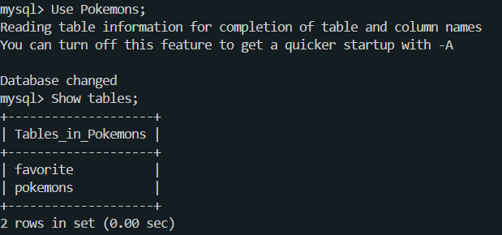

# Proyecto de Pokémons

Este proyecto consta de una aplicación que incluye:
- **Base de datos**: MariaDB
- **Backend**: Node.js
- **Frontend**: React

## Descripción

El proyecto utiliza Docker para ejecutar todos los servicios en contenedores. La base de datos MariaDB tiene una base de datos llamada **Pokemons** con dos tablas:

- **pokemons**: Almacena información sobre los pokémons.
- **favorite**: Almacena los pokémons favoritos de los usuarios.

El backend está hecho con Node.js y proporciona los siguientes endpoints:

### Endpoints para Pokémons

- **GET /pokemon/**: Trae todos los pokémons.
  ```js
  router.get('/', getPokemonsHandler);
  ```

- **GET /pokemon/:value**: Trae pokémons por ID o por nombre.
  ```js
  router.get('/:value', getPokemonsIdandNameHandler);
  ```

### Endpoints para Favoritos

- **GET /favorite/**: Trae todos los pokémons favoritos.
  ```js
  router.get('/', getPokemonsFavHandler);
  ```

- **GET /favorite/:id**: Trae un pokémon favorito por su ID.
  ```js
  router.get('/:id', getPokemonsFavIdHandler);
  ```

- **POST /favorite/**: Añade un pokémon a favoritos.
  ```js
  router.post('/', addPokemonFavHandler);
  ```

- **DELETE /favorite/:id**: Elimina un pokémon de favoritos por su ID.
  ```js
  router.delete('/:id', deletePokemonFavHandler);
  ```

## Requisitos

- **Docker**: Para crear y ejecutar contenedores.
- **Docker Compose**: Para orquestar los contenedores.

## Estructura del Proyecto

El proyecto se divide en los siguientes servicios:

- **MariaDB**: Contenedor para la base de datos.
- **Backend (Node.js)**: API.
- **Frontend (React)**: Interfaz de usuario.

## Despliegue con Docker Compose

Para desplegar el proyecto con Docker Compose, ejecuta el siguiente comando:

```bash
docker-compose up --build
```
## Vista endpoints, Pagina y Base de Datos

### Para ingresar a la página web del front:
- http://localhost:5173/

### Para ver los endpoints: 
- http://localhost:5000/pokemon
- http://localhost:5000/favorite
### Para entrar a la base de datos:

````
docker exec -it mariadb bash  
apt-get update 
apt install mysql-client
mysql -u rootIsaias -p 
````
### Ver las tablas de la Base de Datos Pokemons y realizar consultas

````
Use Pokemons;
Show tables;
SELECT * FROM pokemons;
SELECT * FROM favorite;
````

Para salir del contenedor
- exit


